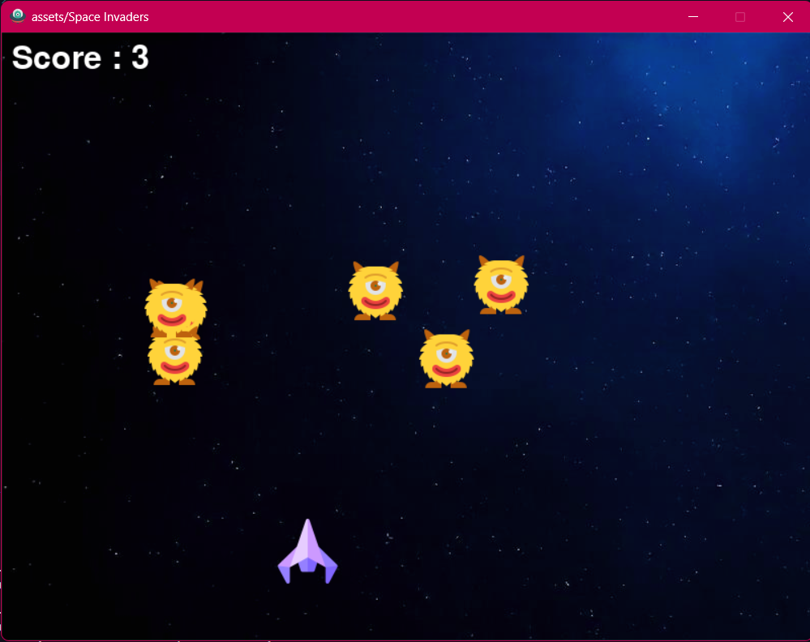

#  🛸 Space Invaders Game 🚀

  

A classic **Space Invaders** game built with **Python & Pygame**. Defend space by shooting enemies while avoiding attacks! 🌌✨

  



  

---

##  🎮 **How to Play**

🔹 **Move Left:**  `←`

🔹 **Move Right:**  `→`

🔹 **Shoot Bullets:**  `Spacebar`

🔹 **Destroy Enemies & Score Points** 🏆

---

##  🛠️ **Installation**

#### 1️⃣ Install **Python** and **Pygame** (if not installed):

```
pip  install  pygame
```
---
 #### 2️⃣ Clone this repository
```
git clone https://github.com/Shravani-1325/SpaceInvader.git
```
--- 
 #### 3️⃣ Navigate to the project folder:
```
cd SpaceInvader
```
---
#### 4️⃣ Run the game

```
python  main.py
```
---
## 📂 **Project Structure**
/SpaceInvader
  ├── main.py          # Main game script
  ├── README.md        # Game instructions
  ├── assets/          # Images & Sounds
  │   ├── spaceship.png
  │   ├── enemy.png
  │   ├── bullet.png
  │   ├── bg.png
  │   ├── play_button.png
  │   ├── game_view.png  # Screenshot of the game
